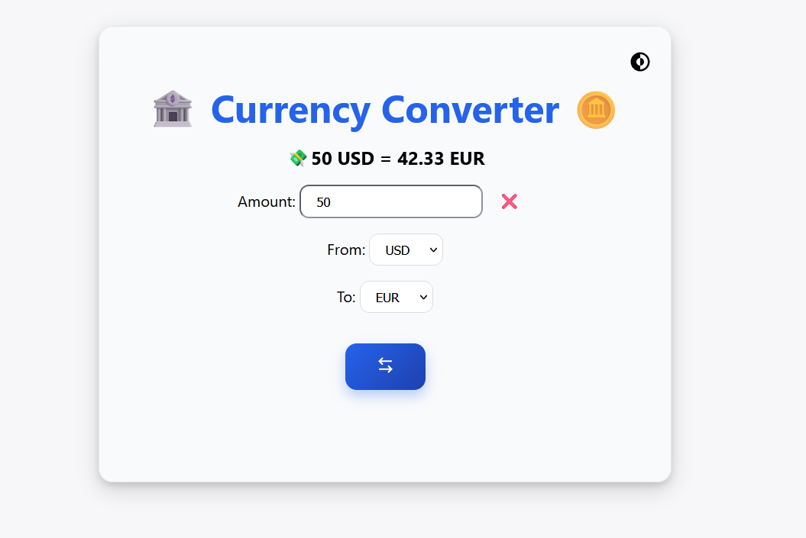
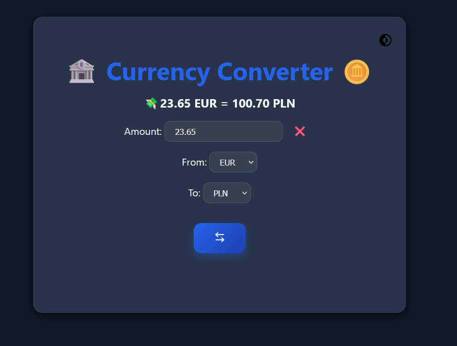

# Currency Converter 🏦🪙

A simple and responsive currency converter web app with **Dark Mode** support.  
Supports conversion between USD, EUR, GBP, and PLN.




---

## Features

- Convert currencies: USD, EUR, GBP, PLN
- Swap currencies quickly
- Dark Mode toggle
- Responsive layout for mobile and desktop
- Clear input with a single click

---

## Technologies

- HTML5
- CSS3
- JavaScript (Fetch API)

---

## Live Demo
👉 [Currency Converter on GitHub Pages](https://mitii146.github.io/currency-conventer/)

## How to Use

1. Clone the repository:
   ```bash
   git clone https://github.com/yourusername/currency-converter.git
   ```
2. Open index.html in your browser.
3. Enter an amount, select currencies, and click Swap or toggle Dark Mode.

## License

This project is open source and free to use.
